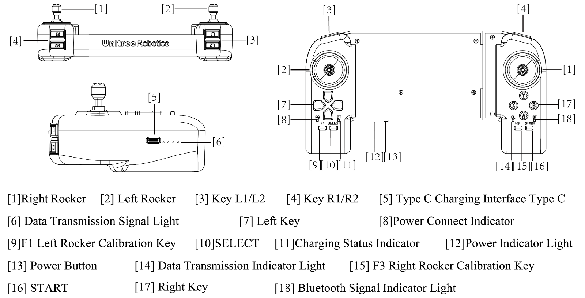

# legged_rl

A [ROS Control](https://wiki.ros.org/ros_control) based reinforcement learning framework for legged robot's traing and deployment. The training part is in the submodule [legged_gym](https://github.com/zitongbai/legged_gym), and the deployment part is the main repo. 

The Sim to Real demo is [here](https://www.bilibili.com/video/BV1gyrxYPEAi/).

# Installation

This repo is tested on **Ubuntu 20.04** with ROS Noetic.

## ROS Noetic

Refer to [ROS Noetic Installation](http://wiki.ros.org/noetic/Installation/Ubuntu) for detailed information.

Some packages are needed for this repo:

```bash
sudo apt install ros-noetic-ros-control ros-noetic-ros-controllers ros-noetic-joy-teleop ros-noetic-rqt-controller-manager ros-noetic-teleop-twist-keyboard
```

## Mujoco

MuJoCo version 3.2.6 has been tested. You can install Mujoco in the following way:

```bash
sudo apt install libglfw3-dev libxinerama-dev libxcursor-dev libxi-dev
```
```bash
# it is not necessary to download the repo in the catkin workspace, you can download, build and install it anywhere you like.
git clone https://github.com/google-deepmind/mujoco.git
mkdir build && cd build
cmake ..
make -j4
sudo make install # install to /usr/local/bin
```
Test:
```bash
simulate
```
If the mujoco simulator pops up, the installation is successful.

## Libtorch

Download libtorch from [pytorch](https://pytorch.org/) (**CPU** version is efficient enough for rl network). Extract it to a `legged_rl/libs`. The final path should be `legged_rl/libs/libtorch`.


## Build this repo

Clone this repo:
```bash
# in ros workspace's src folder
git clone https://github.com/zitongbai/legged_rl.git --recurse-submodules
```

Build:
```bash
# in ros workspace root folder
catkin config --install
catkin build -DPYTHON_EXECUTABLE=/usr/bin/python3 -DCMAKE_EXPORT_COMPILE_COMMANDS=1
```

## Legged gym

Now you have built the deployment part of this repo. The following is for training the RL policy.

1. Create a conda env with python 3.6, 3.7 or 3.8 (3.8 recommended) to train and play RL policy.
   - `conda create -n legged_rl python=3.8`
   - `conda activate legged_rl`
   - Please note that this conda env is only for training RL policy. It is **NOT** used in the deployment part. More precisely, **neither** the ROS workspace **nor** running the RL policy uses this conda env. 
2. Install [pytorch](https://pytorch.org/) in the conda env.
   - `conda install pytorch torchvision torchaudio pytorch-cuda=12.1 -c pytorch -c nvidia`
3. Install Isaac Gym (not necessary in this workspace)
   - Download and install Isaac Gym Preview 4 from https://developer.nvidia.com/isaac-gym
   - make sure you have activated the conda env
   - `cd isaacgym/python && pip install -e .`
   - Try running an example `cd examples && python 1080_balls_of_solitude.py`
   - For troubleshooting check docs `isaacgym/docs/index.html`)
4. Install rsl_rl (PPO implementation)
   - We have a forked version in this repo.
   - make sure you have activated the conda en  v
   - In this repo: `cd rsl_rl && git checkout v1.0.2 && pip install -e .` 
5. Install legged_gym
   - We have a forked version in this repo.
   - make sure you have activated the conda env
   - In this repo: `cd legged_gym && pip install -e .`

You can refer to https://github.com/leggedrobotics/legged_gym for detailed information. 

# Usage

## Train and export
Train go2 with [HIMLoco](https://github.com/OpenRobotLab/HIMLoco/blob/main/projects/himloco/README.md) algorithm: 
```bash
# in legged_rl\legged_gym
python legged_gym/scripts/train.py --task=go2_him --headless --max_iterations=1000
```

After training, play once to export the jit file:
```bash
# in legged_rl\legged_gym
python legged_gym/scripts/play_him.py --task=go2_him
```

Export rl config: 
```bash
# in legged_rl
python legged_gym/legged_gym/scripts/export_config.py --target_dir=legged_robot_example/unitree_go2_description/config --task=go2_him
```

## Sim2Sim in mujoco

Run mujoco:

```bash
roslaunch unitree_go2_description mujoco.launch
```

in another terminal, run controller:

```bash
roslaunch unitree_go2_description load_controllers.launch keyboard:=true
```

In the rqt_controller_manager gui, select `/controller_manager` in `namespace` and load the rl controller by right-clicking the `controllers/rl_controller` and selecting "start".

Now in the pop-up terminal, you can control the robot with the keyboard.

## Sim2Real

- ***Users are advised to follow Unitree's recommendations for safety while using the Go1 in low-level control mode***
- ***This is research code; use at your own risk; we do not take responsibility for any damage.***

Refer to Unitree's [official documentation](https://support.unitree.com/home/en/developer/Quick_start) for network configuration, connections, and other details. Make sure you can successfully run the example code provided by Unitree before running this repo.

1. Get network interface name:
   ```bash
   ifconfig
   ```
2. Change the network interface name in `legged_robot_example/unitree_go2_description/launch/real.launch` to your network interface name.

3. Turn on the robot, use the gamepad to lie down the robot.

4. In one terminal: 
   ```bash
   roslaunch unitree_go2_description real.launch
   ```

5. In another terminal:
   ```bash
   roslaunch unitree_go2_description load_controllers.launch
   ```

6. In another terminal:
   ```bash
   rosrun legged_rl_controller joy_scheduler.py
   ```



- Use left joystick to control linear velocity ($v_x$ and $v_y$) and right joystick to control angular velocity ($\omega_z$). 
- Press `up` in *Left Key* to stand up the robot.
- Press `down` in *Left Key* to lie down the robot.
- Press `Y` in *Right Key* to switch to the RL controller.

# TODO

- [x] Detailed doc
- [x] Test unitree_sdk2_hw on real robot
- [x] Sim to real deployment and test
- [ ] More RL algorithms
- [ ] Guide for adding new robot

# Known Issues:

- [Robot penetrate the terrain in Mujoco](https://github.com/google-deepmind/mujoco/discussions/2307)

# Acknowledge and Reference

- [legged_control](https://github.com/qiayuanl/legged_control)
- [legged_gym](https://github.com/leggedrobotics/legged_gym)
- [rsl_rl](https://github.com/leggedrobotics/rsl_rl)
- [HIMLoco](https://github.com/OpenRobotLab/HIMLoco)
- [rl_sar](https://github.com/fan-ziqi/rl_sar)

